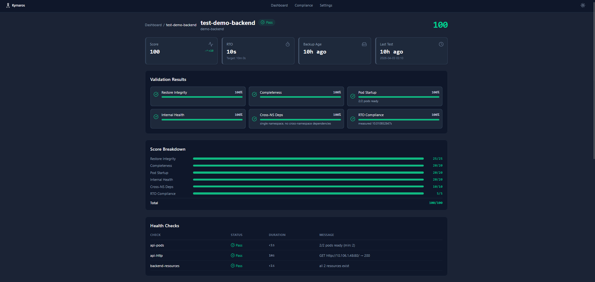

<p align="center">
  
</p>

<h1 align="center">Kymaros</h1>

<p align="center">
  <strong>Continuous backup restore validation for Kubernetes.</strong>
  <br />
  Know your backups actually work — before disaster strikes.
</p>

<p align="center">
  <a href="https://github.com/kymaroshq/kymaros/actions/workflows/test.yml"></a>
  <a href="https://goreportcard.com/report/github.com/kymaroshq/kymaros"></a>
  <a href="LICENSE"></a>
  <a href="https://kubernetes.io"></a>
  <a href="https://go.dev"></a>
</p>

<p align="center">
  <a href="https://kymaros.io">Website</a> · <a href="https://docs.kymaros.io">Docs</a> · <a href="https://docs.kymaros.io/getting-started/quick-start">Quick Start</a> · <a href="https://github.com/kymaroshq/kymaros/discussions">Discussions</a>
</p>

---

Every Kubernetes backup tool tells you **"Backup Completed"**. None of them tell you whether the restore will produce a working application. Kymaros fills that gap.

Every night (or on any schedule), Kymaros restores your backups into isolated sandbox namespaces, runs health checks, measures your real RTO, and gives you a confidence score from 0 to 100. If a Secret got rotated, an API was deprecated, or a PVC can't bind — you find out tomorrow morning, not during the next incident at 3 AM.

<p align="center">
  
</p>

## How it works

```
1. Schedule    →  Cron triggers the test (e.g. every night at 3 AM)
2. Sandbox     →  Creates an isolated namespace (NetworkPolicy deny-all)
3. Restore     →  Triggers a Velero restore into the sandbox
4. Validate    →  Runs health checks: pods ready? HTTP 200? TCP open? Secrets present?
5. Score       →  Calculates a confidence score (0-100) across 6 validation levels
6. Cleanup     →  Deletes the sandbox. Zero residue.
```

The entire test is invisible to your production workloads.

## Quick start

**Prerequisites:** Kubernetes 1.28+, [Velero](https://velero.io) installed with at least one backup.

```bash
# Install Kymaros
helm install kymaros oci://ghcr.io/kymaroshq/kymaros \
  --version 0.6.2 \
  --namespace kymaros-system \
  --create-namespace

# Create a health check policy
kubectl apply -f - <<'EOF'
apiVersion: restore.kymaros.io/v1alpha1
kind: HealthCheckPolicy
metadata:
  name: basic-checks
spec:
  checks:
    - name: pods-ready
      type: podStatus
      podStatus:
        labelSelector:
          app: my-app
        minReady: 1
        timeout: "5m0s"
    - name: api-responds
      type: httpGet
      httpGet:
        service: my-app
        port: 8080
        path: /healthz
        expectedStatus: 200
EOF

# Create your first restore test
kubectl apply -f - <<'EOF'
apiVersion: restore.kymaros.io/v1alpha1
kind: RestoreTest
metadata:
  name: my-app-nightly
spec:
  backupSource:
    provider: velero
    backupName: "latest"
    namespaces:
      - name: my-app
  schedule:
    cron: "0 3 * * *"
  sandbox:
    ttl: "30m0s"
    networkIsolation: "strict"
  healthChecks:
    policyRef: "basic-checks"
  sla:
    maxRTO: "15m0s"
EOF

# Watch it run
kubectl get rt -w
```

Full installation guide: [docs.kymaros.io/getting-started/installation](https://docs.kymaros.io/getting-started/installation)

## Confidence score

Kymaros validates restores across 6 weighted levels:

| Level | Points | What it checks |
|-------|:------:|----------------|
| Restore integrity | 25 | Did the Velero restore complete without errors? |
| Completeness | 20 | Are all Deployments, Services, Secrets, ConfigMaps, PVCs present? |
| Pod startup | 20 | Did all expected pods reach Ready state? |
| Health checks | 20 | Do HTTP endpoints respond? TCP ports open? Resources exist? |
| Cross-namespace deps | 10 | Are inter-namespace dependencies resolved? |
| RTO compliance | 5 | Is the measured restore time within your SLA target? |

**90+** = pass, your restore works end-to-end. **70-89** = partial, investigate. **<70** = fail, something is seriously broken.

## Features

- **Automated nightly testing** — cron-scheduled restore tests, no manual work
- **Sandbox isolation** — NetworkPolicy deny-all, ResourceQuota, LimitRange, auto-cleanup
- **5 health check types** — pod status, HTTP GET, TCP socket, exec command, resource existence
- **6-level scoring** — from "did the restore apply?" to "is the RTO within SLA?"
- **Real RTO measurement** — know your actual recovery time, not a guess
- **Pod log collection** — capture container logs and K8s events from sandbox before cleanup
- **Regression detection** — alerts when a score drops compared to previous runs
- **Prometheus metrics** — 5 custom metrics, ready for Grafana dashboards and alerting
- **Slack & webhook notifications** — get alerted on failure or score drops
- **Multi-namespace restore** — test applications spanning multiple namespaces
- **GitOps-friendly** — everything is a CRD, store in Git, deploy with ArgoCD or Flux
- **Pluggable adapter interface** — Velero built-in, extensible for other backup tools
- **Zero impact on production** — sandboxed, quota-limited, cleaned up automatically

## Prometheus metrics

| Metric | Type | Description |
|--------|------|-------------|
| `kymaros_tests_total` | Counter | Total restore tests executed |
| `kymaros_score` | Gauge | Latest confidence score (0-100) |
| `kymaros_rto_seconds` | Gauge | Measured RTO in seconds |
| `kymaros_test_duration_seconds` | Histogram | Total test duration |
| `kymaros_backup_age_seconds` | Gauge | Age of the last tested backup |

```yaml
# Example alert rule
- alert: KymarosRestoreDegraded
  expr: kymaros_score < 70
  for: 0m
  annotations:
    summary: "Restore score for {{ $labels.test }} dropped to {{ $value }}"
```

## Architecture

Single binary — controller, API server, and React dashboard run in one pod.

```
┌───────────────────────────────────────────────────┐
│                   kymaros pod                      │
│                                                    │
│  ┌────────────┐  ┌──────────┐  ┌───────────────┐  │
│  │ Controller │  │   API    │  │   Frontend    │  │
│  │ (reconciler│  │  (REST)  │  │ (React static)│  │
│  │ + sandbox  │  │ :8080    │  │ :8080         │  │
│  │ + checks)  │  │ /api/v1/ │  │ /*            │  │
│  └──────┬─────┘  └────┬─────┘  └───────────────┘  │
│         │              │                           │
│  controller-    serves both API                    │
│  runtime        and static files                   │
│  manager        on the same port                   │
│                                                    │
│  :8081 health probes  │  :8443 prometheus metrics  │
└───────────────────────────────────────────────────┘
         │
         ▼
  ┌──────────┐
  │  Velero   │
  └──────────┘
```

## CRDs

| CRD | Short name | Description |
|-----|:----------:|-------------|
| `RestoreTest` | `rt` | What to test: backup source, schedule, sandbox config, health checks, SLA |
| `HealthCheckPolicy` | `hcp` | How to validate: pod readiness, HTTP probes, TCP sockets, resource existence |
| `RestoreReport` | `rr` | Test results: score, 6 validation levels, check results, RTO, completeness |

Full CRD reference: [docs.kymaros.io/reference/crds](https://docs.kymaros.io/reference/crds/restoretest)

## FAQ

**Does Kymaros affect production?**
No. Every test runs in an ephemeral sandbox namespace with NetworkPolicy deny-all. Zero traffic to or from production. Auto-deleted after each test.

**Does it work without Velero?**
Currently Velero-only. The adapter interface is pluggable — Kasten K10 and TrilioVault support is on the roadmap.

**How many resources does a test use?**
Depends on the workload being tested. Configure `sandbox.resourceQuota` to cap CPU, memory, and storage. The operator itself uses ~50 MB.

**Is it GitOps compatible?**
Yes. RestoreTest and HealthCheckPolicy are standard Kubernetes CRDs. Store them in Git, deploy with ArgoCD or Flux.

**Can it test multi-namespace applications?**
Yes. List multiple namespaces in `spec.backupSource.namespaces`. Use `networkIsolation: "group"` to allow traffic between sandbox namespaces.

## Development

```bash
git clone https://github.com/kymaroshq/kymaros.git
cd kymaros
make install      # Install CRDs into your cluster
make run          # Run the operator locally
make test         # Run tests
make manifests    # Regenerate CRDs and RBAC
make build        # Build the binary
```

See [CONTRIBUTING.md](CONTRIBUTING.md) for guidelines.

## Documentation

Full documentation is available at **[docs.kymaros.io](https://docs.kymaros.io)**:

- [Installation](https://docs.kymaros.io/getting-started/installation)
- [Quick Start](https://docs.kymaros.io/getting-started/quick-start)
- [Health Check Types](https://docs.kymaros.io/guides/health-checks)
- [Prometheus & Grafana](https://docs.kymaros.io/guides/prometheus-grafana)
- [CRD Reference](https://docs.kymaros.io/reference/crds/restoretest)
- [Troubleshooting](https://docs.kymaros.io/operations/troubleshooting)

## Community

- [GitHub Discussions](https://github.com/kymaroshq/kymaros/discussions) — questions, ideas, show & tell
- [GitHub Issues](https://github.com/kymaroshq/kymaros/issues) — bug reports and feature requests
- [CONTRIBUTING.md](CONTRIBUTING.md) — how to contribute

## License

[Apache License 2.0](LICENSE)
